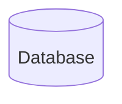
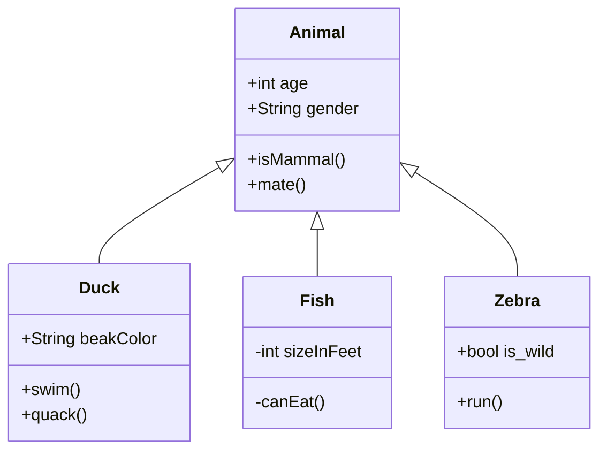

#    

**About arc42**

arc42, the template for documentation of software and system
architecture.

Template Version 8.2 EN. (based upon AsciiDoc version), January 2023

Created, maintained and © by Dr. Peter Hruschka, Dr. Gernot Starke and
contributors. See <https://arc42.org>.

# Introduction and Goals

## Requirements Overview

## Quality Goals

## Stakeholders

| Role/Name              | Contact                                | Expectations                                                                                                                                                                                |
|------------------------|----------------------------------------|---------------------------------------------------------------------------------------------------------------------------------------------------------------------------------------------|
| Swiss Federal Archives | https://github.com/sfa-siard           | Long-term archiving of data sets. Support for common relational database systems. Reliable, correct archiving of big data sets  Cost efficient maintanance and flexible software |
| Archives Worldwide     | -                                      | Long-term archiving of data sets. Support for common relational database systems. Reliable, correct archiving of big data sets Quick Issue handling                             |
| Puzzle ITC             | https://github.com/puzzle              | Main contributor Establishing a community of contributors to the project                                                                                                                |
| DILCIS Board           | https://dilcis.eu/content-types/siard  | Archiving of relation databases according to the specification                                                                                                                              |

# Architecture Constraints

# System Scope and Context

## Business Context

**\<Diagram or Table>**

**\<optionally: Explanation of external domain interfaces>**

## Technical Context

**\<Diagram or Table>**

**\<optionally: Explanation of technical interfaces>**

**\<Mapping Input/Output to Channels>**

# Solution Strategy

# Building Block View

## Whitebox Overall System

***\<Overview Diagram>***

Motivation

:   *\<text explanation>*

Contained Building Blocks

:   *\<Description of contained building block (black boxes)>*

Important Interfaces

:   *\<Description of important interfaces>*

### \<Name black box 1>

*\<Purpose/Responsibility>*

*\<Interface(s)>*

*\<(Optional) Quality/Performance Characteristics>*

*\<(Optional) Directory/File Location>*

*\<(Optional) Fulfilled Requirements>*

*\<(optional) Open Issues/Problems/Risks>*

### \<Name black box 2>

*\<black box template>*

### \<Name black box n>

*\<black box template>*

### \<Name interface 1>

...
[top](#introduction-and-goals)

### \<Name interface m>

## Level 2

### White Box *\<building block 1>*

*\<white box template>*

### White Box *\<building block 2>*

*\<white box template>*

...

### White Box *\<building block m>*

*\<white box template>*

## Level 3

### White Box \<\_building block x.1\_\>

*\<white box template>*

### White Box \<\_building block x.2\_\>

*\<white box template>*

### White Box \<\_building block y.1\_\>

*\<white box template>*

# Runtime View

## \<Runtime Scenario 1>

-   *\<insert runtime diagram or textual description of the scenario>*

-   *\<insert description of the notable aspects of the interactions
    between the building block instances depicted in this diagram.\>*

## \<Runtime Scenario 2>

## ...

## \<Runtime Scenario n>

# Deployment View

## Infrastructure Level 1

***\<Overview Diagram>***

Motivation

:   *\<explanation in text form>*

Quality and/or Performance Features

:   *\<explanation in text form>*

Mapping of Building Blocks to Infrastructure

:   *\<description of the mapping>*

## Infrastructure Level 2

### *\<Infrastructure Element 1>*

*\<diagram + explanation>*

### *\<Infrastructure Element 2>*

*\<diagram + explanation>*

...

### *\<Infrastructure Element n>*

*\<diagram + explanation>*

# Cross-cutting Concepts

## *\<Concept 1>*

*\<explanation>*

## *\<Concept 2>*

*\<explanation>*

...

## *\<Concept n>*

*\<explanation>*

# Architecture Decisions

# Quality Requirements

## Quality Tree

## Quality Scenarios

# Risks and Technical Debts

# Glossary

+-----------------------+-----------------------------------------------+
| Term                  | Definition                                    |
+----------------------=+----------------------------------------------=+
| *\<Term-1>*           | *\<definition-1>*                             |
+-----------------------+-----------------------------------------------+
| *\<Term-2>*           | *\<definition-2>*                             |
+-----------------------+-----------------------------------------------+
