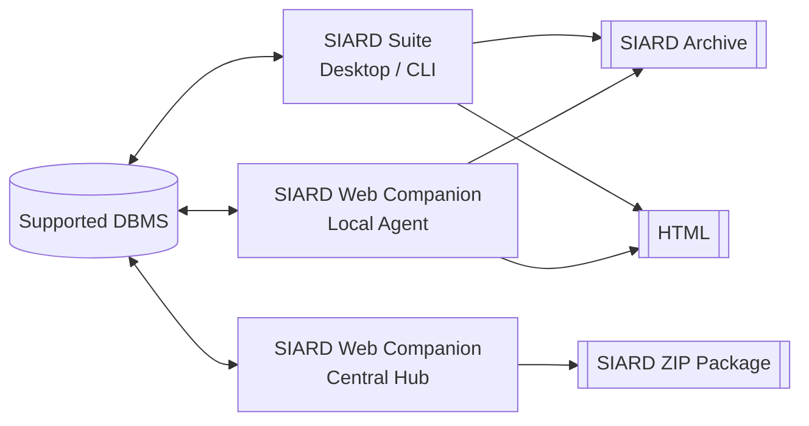
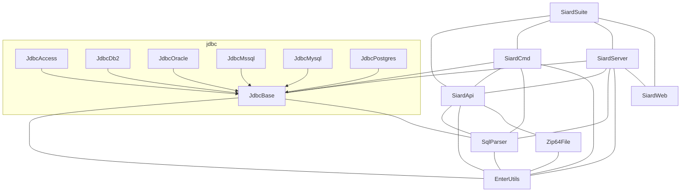

# Software Architecture Documentation - Companion Architecture

This document is an extension to the [Software Architecture Documentation](software-architecture-documentation.md).
It adheres to new constraints and requirements from the Swiss Federal Archives.

The documentation and architectural decisions in this document describe the **SIARD Suite Web Companion**, a browser-accessible addition to the existing desktop and command-line applications.

See also:

- [Web Companion Product Roadmap](../web-companion-plan.md) — phased delivery plan and customer-facing decisions.
- [Web Companion Spike Plan](web-companion-spike-plan.md) — one-week backend framework selection spike.
- [Refactoring Plan](../refactoring-plan.md) — improvements to the existing codebase that make Web Companion reuse easier.
- [Architecture Decision Records](../decisions/README.md) — formal records of key design decisions.

## Table of Contents

- [1. Introduction and Goals](#1-introduction-and-goals)
- [2. Architecture Constraints](#2-architecture-constraints)
- [3. System Scope and Context](#3-system-scope-and-context)
- [4. Building Block View](#4-building-block-view)
- [5. Runtime View](#5-runtime-view)
- [6. Security](#6-security)
- [7. Implementation Notes](#7-implementation-notes)
- [8. Risks and Technical Debts](#8-risks-and-technical-debts)
- [9. Glossary](#9-glossary)

## 1. Introduction and Goals

### Requirements Overview

SIARD Suite is currently a desktop (JavaFX) and command-line application. The
funding client can no longer deploy Java runtimes or downloaded executables on
managed end-user systems. They need a delivery model that:

- Does not require a Java runtime on the end-user desktop.
- Can be centrally deployed and updated by their IT department.
- Still allows users to archive databases that are only reachable from inside
  restricted networks.

While the main purpose of SIARD Suite will remain the same (archiving relational databases), the suite must be seen in a broader context. Archives produced by SIARD Suite are further processed by the SFA. The archive is enriched with additional metadata and packaged in a generic package for long term storage.

Delivering offices like other federal institutions or cantonal departments should be able to upload their own SIARD archives to the SFA.
Other services should then be able to pick up the uploaded archives and process them further.

The **Web Companion** satisfies these needs by adding a headless backend and a web frontend to the existing SIARD Suite modules. The existing desktop and CLI applications remain unchanged.

### Quality Goals

| Prio | Quality Goal | Description |
| --- | --- | --- |
| 1 | Security | Unauthorized access to sensitive data must be prevented. |
| 2 | Reliability | Archiving a database may take hours. The system must be able to handle large datasets and notify users reliably about the progress and finished tasks. |
| 3 | Portability | The application must be able to run on different operating systems and hardware. |
| 4 | Deployability | The application supports both local-agent and central-hub deployments. |

### Stakeholders

| Role/Name | Contact | Expectations |
|---|---|---|
| Swiss Federal Archives (SFA) | https://github.com/sfa-siard | Long-term archiving of datasets. Support for common relational database systems.  Reliable, correct archiving of big datasets.  The software must run given the constraints on SFA laptops and workstations.  Cost-efficient maintenance and flexible software. |
| Archives worldwide | - | Long-term archiving of datasets. Support for common relational database systems.  Reliable, correct archiving of big datasets.  Quick Issue handling. |
| SIARD Suite users | - | Good User Experience Support for a variety of different DBMS. |
| Puzzle ITC AG (main contributor) | https://github.com/puzzle | |
| Developers, contributors | - | Modern Java, clean codebase. Simple setup including a variety of databases with test data. |

## 2. Architecture Constraints

### Technical Constraints

| Constraint | Explanation, Background |
|---|---|
| Swiss Federal Archives (SFA) staff cannot execute binary files or scripts and have no Java runtime available on their business laptops. | Computers (aka Bundeslaptops) used by the SFA are managed by the Bundesamt für Informatik und Telekommunikation (BIT). Users are not allowed to install any software on these machines. |

Consequence: SFA staff must use the Web Companion through a browser only. Any local agent or executable is not a delivery option for them.

## 3. System Scope and Context

### Business Context

The existing desktop and CLI applications continue to serve users who can run Java binaries or need direct access to databases.

The **Web Companion Central Hub** is the intended primary delivery model for SFA staff once it is implemented. It will be deployed and maintained by IT and accessed through a browser. It can archive databases that are reachable from the hub's network context.

The **Web Companion Local Agent** is the first deliverable. It is a secondary delivery model for users or databases that cannot be reached from a central server. It runs on the user's machine or on a server in the target network and is controlled from the same browser-based frontend.

### Technical Context

SIARD Suite is a standalone Java application that runs on Linux, Windows, and Mac. The connection to the databases is done using vendor-specific JDBC drivers using a JDBC URL.

The Web Companion wraps the existing SIARD core libraries (`SiardApi`, the JDBC wrappers, `SiardCmd`) in an HTTP/REST server. A browser-based frontend talks to this server.

The companion can run in two roles:

1. **Local agent** — runs close to the database, controlled from the browser, no authentication, localhost-only binding.
2. **Hub** — runs centrally, reachable from many users, requires authentication, persistent job store, per-user file isolation.

## 4. Building Block View

### Whitebox Overall System

### Deployment Roles

The `SiardServer` module is built into two runtime artifacts:

| Artifact | Role | Authentication | Persistence | Bind address |
|---|---|---|---|---|
| `siard-agent` | Local agent | None | SQLite file | `127.0.0.1` only |
| `siard-hub` | Central hub | OIDC to Keycloak | PostgreSQL | Configured external interface |

The two artifacts are built from one codebase from the start. The hub artifact may initially contain only stub or minimal functionality while the central hub features are implemented, but the module and build split are in place from the beginning to avoid accidental misconfiguration.

## 5. Runtime View

### Archive Job Flow

1. The user opens the web frontend and authenticates (hub only). On first login without an assigned SIARD role, the user sees a read-only "access pending" page.
2. The user submits a database connection and archive options to `POST /api/v1/jobs/archive`.
3. The server creates a persistent job, encrypts database credentials at rest, and queues the job.
4. The executor runs the archive using the existing `siard-api` and JDBC wrappers directly in the same JVM.
5. Progress events are pushed to the frontend via Server-Sent Events.
6. When the job completes, the resulting SIARD archive (and optional external LOB folder) is stored in the configured storage backend.
7. The user downloads the result as a single SIARD file (local agent) or as a ZIP package (hub mode with external LOBs).

### Restore / Browse Job Flow

1. The user uploads an existing SIARD archive. In hub mode this is either a single `.siard` file or a ZIP package containing the `.siard` file and its external LOB folder.
2. The server validates the upload strictly: SIARD 2.2 schema, external LOB references, path traversal checks.
3. The user submits a restore or browse job. The job runs against the target database or is presented read-only in the browser.

## 6. Security

### Authentication and Authorization

- **Local agent mode**: No authentication. The service binds to `127.0.0.1` only.
- **Hub mode**: The hub authenticates users through **Keycloak** using OIDC. Keycloak is the primary user directory and may federate to external identity providers such as the SFA/BIT **EIAM** solution or other corporate IdPs. The hub itself does not talk directly to EIAM or other IdPs.

#### Roles

Authorization is role-based. Keycloak users or groups are mapped to internal SIARD roles:

- `ARCHIVE` — submit archive jobs.
- `RESTORE` — submit restore jobs.
- `ADMIN` — manage all jobs and users within the hub. Actual role assignment is done in Keycloak by a Keycloak administrator.

#### User provisioning and first login

1. Users authenticate through an upstream identity provider configured in Keycloak (e.g., EIAM) or have a Keycloak account created by an administrator.
2. On first login, Keycloak auto-provisions the user account.
3. An administrator assigns the SIARD role in Keycloak.
4. Until a role is assigned, the user can log in but sees only a read-only "access pending" page.
5. The hub polls Keycloak periodically (e.g., every 5 minutes) for new users and users without a SIARD role, and sends an email notification to configured administrators.
6. The hub exposes a lightweight "pending users" admin page for convenience.

#### User identity and lifecycle

- The **Keycloak user ID** (UUID) is the stable identifier used internally for job ownership, file isolation, and audit logs.
- Email and username are treated as display attributes and may change.
- If a user is disabled or deleted in Keycloak, existing jobs and files remain attributed to the user ID for audit and provenance, but the user cannot submit new jobs or download results.

#### Session handling

- The React SPA uses the **authorization code flow with PKCE**.
- The hub backend holds the refresh token in an `httpOnly` cookie.
- Access tokens are short-lived and validated offline using Keycloak's JWKS endpoint.
- Token lifetimes are configurable; suggested defaults are 15 minutes for access tokens and 8 hours for refresh tokens.
- Logout uses front-channel logout (redirect to Keycloak) plus backchannel logout from Keycloak to the hub when the session is revoked.

#### Frontend delivery

The hub backend serves the SPA bundle, so the SPA and API are same-origin and no CORS is required. The local agent also serves its own frontend bundle.

#### Multi-factor authentication

MFA is not implemented in the hub. It is delegated to Keycloak and the upstream identity providers (e.g., EIAM) according to the deployer's security policy.

#### Realm topology

Each hub deployment uses its own Keycloak realm. Multi-realm or multi-tenant deployments are a future extension, not part of the MVP.

### Security Requirements

1. **Bind-address enforcement**  
   Local agent mode must bind to `127.0.0.1` only and refuse to start on a non-loopback interface. Hub mode must require an explicit configuration flag and external bind address.

2. **CSRF and origin handling**  
   The backend serves the SPA bundle, so the API and frontend are same-origin in both hub and local-agent modes. On `localhost`, the local agent must still validate origins to prevent malicious websites from reaching the agent.

3. **Job result access control**  
   In hub mode, only the job owner or granted roles may query a job and download its SIARD file.

4. **Credential handling**  
   Database credentials must not be logged or stored in plaintext. In hub mode, credentials are encrypted at rest with a hub-managed key and decrypted only at job execution time.

5. **File upload and download safety**  
   Validate uploaded SIARD files, prevent path traversal in downloads, and avoid serving files outside the configured working directory.

6. **DoS and resource exhaustion**  
   Limit concurrent long-running jobs, file sizes, and temporary disk usage so one user cannot exhaust the server.

7. **Transport security**  
   Hub mode must use TLS, even behind a reverse proxy. Local agent mode may use plain HTTP on `localhost` but should still validate origins.

8. **Audit logging**  
   In hub mode, log who submitted which job, against which database, and who downloaded which result. Retention follows SFA policy (suggest seven years for an archival context).

9. **Frontend supply chain**  
   The web frontend depends on npm packages. Generate an SBOM and scan dependencies as part of CI/CD.

10. **Secure defaults**  
    The artifact must default to local mode, refuse to run as root or admin, and fail safe rather than fall back to an open configuration.

## 7. Implementation Notes

### Dependencies on Existing Code Refactoring

The `siard-server` backend reuses the existing `siard-api`, JDBC wrappers, and
parts of `siard-cmd`. Some refactorings described in
[Refactoring Plan](../refactoring-plan.md) make this reuse easier:

- Extracting config and orchestrator classes from `siard-cmd` lets the web
  backend drive archive/restore logic without duplicating CLI argument parsing.
- Eliminating `siard-api` interface-to-impl downcasting improves testability and
  makes the core logic easier to compose in the web backend.
- Introducing domain exceptions instead of `IOException` for business errors
  gives the web backend clearer error handling and user-facing messages.

These refactorings can proceed in parallel with the Web Companion work, but
early alignment on the extracted APIs avoids rework.

### Backend Framework

The backend framework is chosen after a focused spike comparing Quarkus and Spring Boot. The spike validates:

- Container image build size and startup time.
- Native-image feasibility for `siard-api` (JAXB) and JDBC drivers.
- OIDC authentication integration with Keycloak as the identity provider.
- PostgreSQL persistence, migrations, and job state management.
- Compatibility with the existing `siard-api` and JDBC wrappers.
- Developer experience and build integration with the Gradle monorepo.

### Frontend Technology

The frontend is a TypeScript/React single-page application built with Vite, TanStack Query for server state, and a component library aligned with any existing SFA design system.

### Persistence and Storage

- **Job state**: PostgreSQL in hub mode; SQLite file in local agent mode.
- **Local agent SQLite file**: defaults to a user-specific directory (`%LOCALAPPDATA%/siard-agent/jobs.db` on Windows, `$XDG_DATA_HOME/siard-agent/jobs.db` or `~/.local/share/siard-agent/jobs.db` on Linux). The path is configurable from the start.
- **Job store abstraction**: a shared `JobStore` abstraction is used by both hub and local agent. The hub implementation uses PostgreSQL; the local agent implementation uses SQLite.
- **Migrations**: Flyway is used for both PostgreSQL and SQLite with the same schema.
- **Generated SIARD files**: pluggable storage interface. The spike uses the local filesystem; object storage can be added later.
- **Database credentials**: encrypted at rest with a hub-managed key.
- **Resume**: resuming interrupted archive/restore jobs is not supported by the underlying `siard-api` / `siard-cmd` and is out of scope for the MVP. Persistence is used for job history, status, and troubleshooting only.
- **Local agent history retention**: job history is kept indefinitely in the SQLite file; the user can delete the SQLite file or reconfigure its path to reset it.

### API and Job Model

The API is RESTful and versioned in the URL path (`/api/v1/...`). It is documented with OpenAPI.

Long-running jobs are asynchronous. The core endpoints are:

- `POST /api/v1/jobs/archive` — submit a database-to-SIARD job.
- `POST /api/v1/jobs/restore` — submit a SIARD-to-database job.
- `GET /api/v1/jobs/{id}` — query status and result.
- `GET /api/v1/jobs/{id}/download` — fetch the generated SIARD file or ZIP package.
- Server-Sent Events endpoint for progress updates.
- `GET /health` and `/metrics` for operations.

### External LOBs

SIARD archives can store large objects (LOBs) outside the `.siard` file in an external LOB folder. This keeps the `.siard` file small but creates a two-part artifact.

- **Local agent mode**: keep the existing behavior. The agent can read and write the `.siard` + external LOB folder pair directly on the user's filesystem.
- **Hub mode**: support external LOBs through **ZIP package downloads and uploads**. Clear validation and user feedback ensure LOB references are never accidentally broken.

### Testing

- Unit tests for business logic.
- Integration tests with Testcontainers (PostgreSQL, mocked OIDC).
- CI/CD generates SBOMs and scans dependencies.

## 8. Risks and Technical Debts

| Risk / Debt | Mitigation |
|---|---|
| **Backend framework choice** | Run a one-week spike comparing Quarkus and Spring Boot before committing. |
| **GraalVM native image** | `siard-api` uses JAXB and JDBC drivers; native-image metadata may be non-trivial. Evaluate during the spike before deciding on native image delivery. |
| **License compatibility** | CDDL-1.0 is compatible with Apache-2.0 dependencies, but verify distribution requirements when bundling new frameworks. |
| **UI logic reuse** | Much of the business flow may currently live in JavaFX controllers and need to be reimplemented in the web frontend. |
| **Security boundary** | Mixing local and hub modes in one artifact increases the risk of accidental exposure. `siard-agent` and `siard-hub` artifacts are produced from the start; the hub artifact may initially be minimal. |
| **External LOB handling** | ZIP packaging adds user-facing complexity; clear UI guidance is required. |
| **Credential storage** | Encrypt at rest; consider a secrets manager or short-lived credentials in later releases. |

## 9. Glossary

| Term | Definition |
|---|---|
| BIT | Bundesamt für Informatik und Telekommunikation |
| SFA | Swiss Federal Archives, Bundesarchiv |
| SIARD | Software-Independent Archival of Relational Databases |
| LOB | Large Object |
| OIDC | OpenID Connect |
| SSO | Single Sign-On |
| SBOM | Software Bill of Materials |
