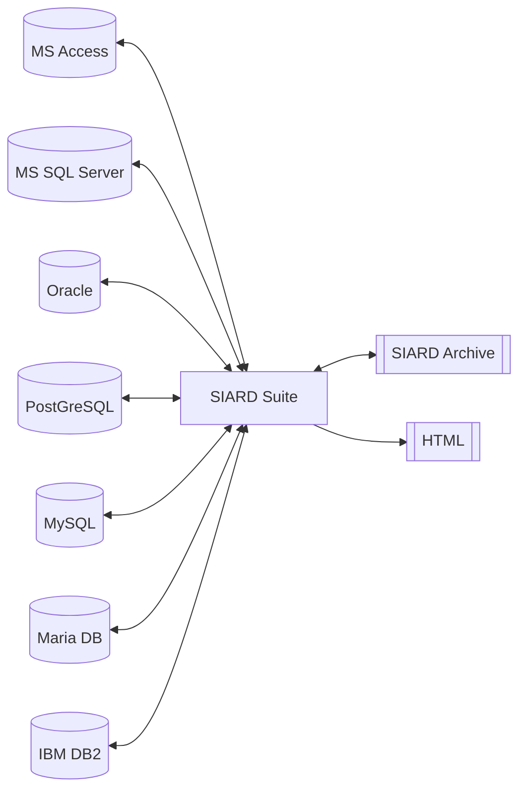
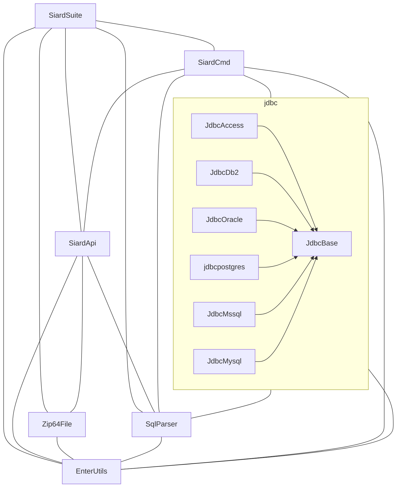

# Software Architecture Documentation

Based on the [arc42](https://arc42.org) template for documentation of software and system architecture, by Dr. Peter Hruschka, Dr. Gernot Starke and contributors.

## Table of Contents

- [1. Introduction and Goals](#1-introduction-and-goals)
- [2. Architecture Constraints](#2-architecture-constraints)
- [3. System Scope and Context](#3-system-scope-and-context)
- [4. Building Block View](#4-building-block-view)
- [5. Risks and Technical Debts](#5-risks-and-technical-debts)
- [6. Glossary](#6-glossary)

## 1. Introduction and Goals

### Requirements Overview

What is SIARD Suite?

- SIARD Suite is a set of tools for the long-term archiving of data stored in relational databases as SIARD archives.
- SIARD Suite is the reference implementation of the [SIARD Specification](https://siard.dilcis.eu/SIARD%202.2/SIARD%202.2.pdf).

Main Features:

- Support for multiple relational database management systems.
- Graphical user interface (GUI) and command-line interface (CLI) for archiving and restoring data.
- Clients for Windows, Mac, and Linux.

### Stakeholders

| Role/Name | Contact | Expectations |
|---|---|---|
| Swiss Federal Archives (SFA) | https://github.com/sfa-siard | Long-term archiving of datasets. Support for common relational database systems.  Reliable, correct archiving of big datasets.  The software must run given the constraints on SFA laptops and workstations.  Cost-efficient maintenance and flexible software. |
| Archives worldwide | - | Long-term archiving of datasets. Support for common relational database systems.  Reliable, correct archiving of big datasets.  Quick Issue handling. |
| SIARD Suite users | - | Good User Experience Support for a variety of different DBMS. |
| Puzzle ITC AG (main contributor) | https://github.com/puzzle | |
| Developers, contributors | - | Modern Java, clean codebase. Simple setup including a variety of databases with test data. |

## 2. Architecture Constraints

### Technical Constraints

| Constraint | Explanation, Background |
|---|---|
| Swiss Federal Archives (SFA) staff cannot execute binary files or scripts | Computers (aka Bundeslaptops) used by the SFA are managed by the Bundesamt für Informatik und Telekommunikation (BIT). Users are not allowed to install any software on these machines. |

## 3. System Scope and Context

### Business Context

The Application `SIARD Suite` is able to read data from various database systems in order to create a SIARD Archive file. The application can also read a SIARD Archive and upload it into a database. This is not necessarily the same DBMS as the original data source.

A (somewhat limited) export function allows users to export data from an archive as html files.

### Technical Context

SIARD Suite is a standalone Java Application that runs on Linux, Windows, and Mac. The connection to the databases is done using vendor-specific JDBC drivers using a jdbc url.

## 4. Building Block View

### Whitebox Overall System

### Contained Building Blocks

| Module | Repository |
|---|---|
| SiardSuite | https://github.com/sfa-siard/siard-suite |
| SiardApi | https://github.com/sfa-siard/SiardApi |
| SiardCmd | https://github.com/sfa-siard/SiardCmd |
| SqlParser | https://github.com/sfa-siard/SqlParser |
| JdbcBase | https://github.com/sfa-siard/JdbcBase |
| JdbcAccess | https://github.com/sfa-siard/JdbcAccess |
| JdbcDb2 | https://github.com/sfa-siard/JdbcDb2 |
| JdbcOracle | https://github.com/sfa-siard/JdbcOracle |
| JdbcMssql | https://github.com/sfa-siard/JdbcMsSql |
| JdbcMysql | https://github.com/sfa-siard/JdbcMySql |
| JdbcPostgres | https://github.com/sfa-siard/JdbcPostgres |
| EnterUtils | https://github.com/sfa-siard/EnterUtilities |
| Zip64File | https://github.com/sfa-siard/Zip64File |

## 5. Risks and Technical Debts

### MaterialFX

For compatibility with Java 8, Siard Suite has been using a MaterialFx dependency that was ported to Java 8: https://github.com/Glavo/MaterialFX-Java8.
Now that SIARD software has been migrated to Java 17, this old dependency can be replaced with the official one: https://github.com/palexdev/MaterialFX. However, there are likely to be some breaking changes and the UI might have to be adapted.

## 6. Glossary

| Term | Definition |
|---|---|
| BIT | Bundesamt für Informatik |
| SFA | Swiss Federal Archives, Bundesarchiv |
