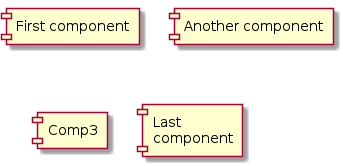

ifndef::imagesdir[:imagesdir: ../images]

[[section-system-scope-and-context]]
== System Scope and Context

=== Business Context

**<Diagram or Table>**

**<optionally: Explanation of external domain interfaces>**

=== Technical Context

**<Diagram or Table>**

**<optionally: Explanation of technical interfaces>**

**<Mapping Input/Output to Channels>**
